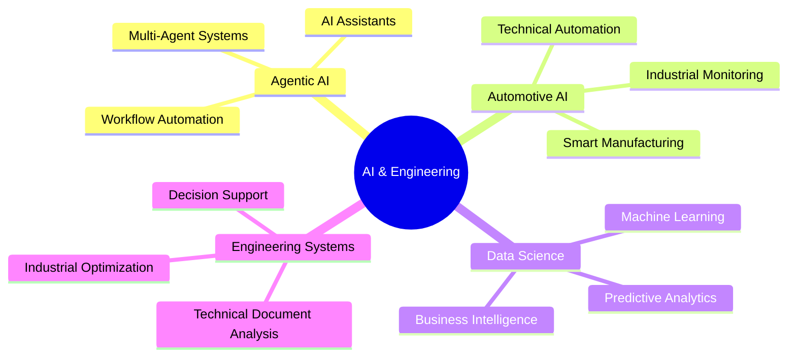

 

  

---

#  About Me

Passionate **AI Engineer & Data Scientist** focused on designing intelligent systems, autonomous AI agents, and scalable data-driven applications that solve real-world engineering and industrial challenges.

I enjoy transforming complex data into impactful solutions through:

<table>
<tr>
<td align="center" width="20%">
 
<b>Agentic AI</b>
</td>

<td align="center" width="20%">
 
<b>Data Science</b>
</td>

<td align="center" width="20%">
 
<b>Deep Learning</b>
</td>

<td align="center" width="20%">
 
<b>Computer Vision</b>
</td>

<td align="center" width="20%">
 
<b>NLP & LLMs</b>
</td>
</tr>
</table>

I’m especially interested in building:

- Intelligent AI workflows  
- Multi-agent systems  
- Automation pipelines  
- Interactive analytical platforms  
- Industrial AI solutions  
- Smart engineering assistants  

---

#  Automotive & Industrial AI

Strongly passionate about the **automotive industry** and the integration of AI into engineering and manufacturing ecosystems.

| Industrial AI | Engineering Automation | Smart Manufacturing |
|---|---|---|
| AI Workflow Automation | Technical Document Analysis | Industrial Monitoring |
| Intelligent Engineering Assistants | Process Optimization | Production Analytics |
| Autonomous AI Agents | Engineering Decision Systems | Smart Operations |

I enjoy creating AI-powered tools capable of optimizing technical workflows, automating repetitive engineering processes, and improving industrial efficiency through intelligent systems.

---

#  Core Expertise

<table>
<tr>
<td width="33%" align="center">

### AI & Automation

AI Agents  
Multi-Agent Systems  
Workflow Automation  
NLP & LLM Applications  
Computer Vision  

</td>

<td width="33%" align="center">

### Data Science

Machine Learning  
Deep Learning  
Predictive Analytics  
Industrial Analytics  
Business Intelligence  

</td>

<td width="33%" align="center">

### Engineering AI

Automotive AI  
Technical AI Systems  
Industrial Monitoring  
Decision Support Systems  
Smart Manufacturing  

</td>
</tr>
</table>

---

#  Tech Stack

## AI • Machine Learning • Agentic AI

  

---

## Dashboards • Visualization • BI

---

## Backend • APIs • Development

---

#  Areas of Interest

---

#  Current Focus

| Focus Area | Technologies |
|---|---|
| AI Agents for Engineering | LangChain • FastAPI • Python |
| Industrial Automation | AI Workflows • Automation Systems |
| Intelligent Technical Analysis | NLP • LLMs • Data Processing |
| Smart Dashboards & BI | Power BI • Plotly • Streamlit |
| Automotive AI Solutions | Industrial Analytics • Monitoring |

---

### Building intelligent systems that connect AI, automation, and engineering.

